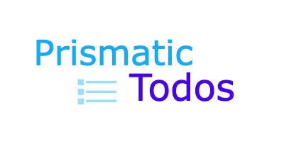

# Full Stack Typescript Todos

## Table of Contents

- [License](#license)
- [Description](#description)
- [Technologies Used](#technology)
- [Usage](#instructions)
- [Contact](#contact)

## License

## Description

This is a full stack Typescript application that uses MongoDB on the back end and React on the front end. Users can create and edit tasks using a front end built with React and typescript. The backend is built with typescript, Express, MySQL, and Sequelize.

## Technology

<ul>
    <li>Typescript</li>
    <li>React 18</li>
    <li>Express</li>
    <li>MySQL</li>
    <li>Sequelize</li>
</ul>

## Usage

Users can use the registration link to create an account, and then can log in to the application with their new accounts. Once users are logged in then they can add a task to their todo list, edit a task, or mark a task as completed. Once a task is marked complete, it is removed from the database.

## Contact

Github: [PrismaticDevs](https://github.com/PrismaticDevs)  
Email: matthewbrignola@gmail.com  
Phone: 719-351-5828  

